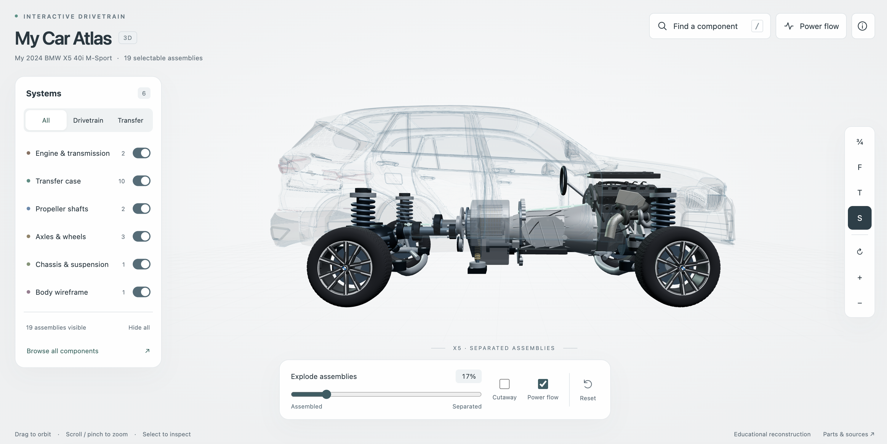

# My Car Atlas — complete local application

This project is inspired by **my own car: a 2024 BMW X5 40i M-Sport (G05 LCI)**. It is an interactive 3D atlas for exploring the drivetrain, engine and mechanics of xDrive.



The supplied vehicle record identifies Alpine White III paint (300), Silverstone decorative-stitched Sensafin upholstery (KPA9), a B58B30M2 engine listed at 280 kW / 540 Nm, European left-hand drive and all-wheel drive. Its equipment list confirms 740 M wheels, M Sport brakes, Sport automatic transmission, Adaptive M suspension, Shadowline trim and adaptive LED headlights. The atlas reflects these in the body finish and component descriptions; **About → My car’s specification** lists the details. Production is listed as 20 November 2023 in Spartanburg; the 2024 designation is owner-supplied. The cabin and driver-assistance functions are not modelled.

## Start on macOS, Windows, or Linux

1. Install Node.js 20 or newer if it is not already installed. Check with `node --version`.
2. Open a terminal in the project directory (the folder containing `package.json`).
3. Run:

   ```sh
   npm start
   ```

4. Open **http://localhost:3000** in Chrome, Edge, Firefox, or Safari. Keep the terminal open while using the atlas. Press Ctrl+C to stop.

No `npm install`, build step, API key, database, or account is required. You can also run `node server.mjs` directly. All runtime dependencies and reference images are included. The page uses local system fonts and works without an internet connection; external source links naturally require internet access.

**Do not double-click `dist/index.html`.** This frontend uses JavaScript modules, which must be served over HTTP. Opening it through `file://` can leave the page stuck at “Loading”.

If port 3000 is already in use:

- macOS/Linux: `PORT=3001 npm start`
- PowerShell: `$env:PORT=3001; npm start`
- Windows Command Prompt: `set PORT=3001&& npm start`

Then open http://localhost:3001.

## Included source

| File | Purpose |
| --- | --- |
| `server.mjs` | Node HTTP backend: static assets, correct module/image content types, `/api/health`, startup and shutdown |
| `package.json` | Start, development, and test commands; no third-party server dependencies |
| `dist/index.html` | Complete frontend layout and dialogs |
| `dist/style.css` | Responsive frontend styling |
| `dist/app.js` | Camera, selection, references, controls, and scenarios |
| `dist/catalogue.js` | Searchable component names, descriptions, and driving scenarios |
| `dist/explorer.js` | System membership, visibility, search, and tap-versus-drag rules |
| `dist/model.js` | Three.js drivetrain, component geometry and body integration |
| `dist/engine.js` | Reference-modelled B58B30M2 engine, hydraulic mounts and cutaway |
| `dist/engine-references.js` | BMW engine/mounting drawing index for catalogue type 21EU |
| `dist/body.js` | G05 LCI M Sport exterior adaptation and wireframe presentation |
| `dist/models/` | Bundled BMW G05 foundation, provenance manifest and CC BY 4.0 attribution |
| `scripts/build-body.mjs` | Deterministic conversion of the pinned BMW source files |
| `dist/references.js` | Reference metadata and detailed component inventory |
| `dist/three.module.js` | Included Three.js r170 dependency with its license |
| `dist/references/` | Original and researched reference images |
| `dist/references/engine/` | 28 BMW drawings, donor-engine photograph and checksum/source manifest |
| `COMPONENT-REFERENCES.md` | Source links and applicability notes |
| `tests/server.test.mjs` | HTTP delivery and asset integrity checks |
| `tests/explorer.test.mjs` | Component coverage, search, gesture, and rendered isolation checks |
| `tests/engine.test.mjs` | LCI engine identity, image integrity, geometry and cutaway regression checks |
| `tests/browser.mjs` | Optional Playwright checks for desktop, phone, and landscape interactions |

The backend serves only the `dist` directory and binds to this computer. `/api/health` returns JSON confirming that the server is running. The model runs in the browser; it requires WebGL2. If the browser reports a WebGL problem, enable graphics acceleration and restart it.

## Use and edit

My own 2024 BMW X5 40i M-Sport is the inspiration for the project. The interface also takes inspiration from the scene-centered exploration pattern of [Human Atlas](https://github.com/ashemag/human-atlas), adapted to this drivetrain and its 19 selectable assemblies.

- Use **Find a component** or `/` to search component names and IDs. Arrow keys browse results; Enter opens the selected component. Hidden systems are revealed when a search result is selected.
- Toggle the six **Systems**, choose **All**, **Drivetrain**, or **Transfer**, or click a system name to show it alone. On phones, open Systems from the bottom dock.
- Click a component in the model to highlight it and read its details. **Isolate component** shows that component; selecting the transfer-case assembly includes its internals. **Show surrounding systems** restores the current layers.
- Drag to orbit, scroll/pinch to zoom, or use the camera buttons. Zoom buttons remain available when component details are open on phones. With the canvas focused, arrow keys rotate and `+`/`-` zoom. Internal component selection opens the cutaway without automatically isolating the assembly.
- **Explode assemblies** separates components; **Cutaway** exposes housings; **Power flow** toggles animated drive paths. **Reset** restores all layers, the assembled model, chain layout, and overview camera. Driving scenario and playback remain separate controls.
- **Power flow** in the top navigation opens the driving scenarios, playback, driving mode, and reference layout comparison. Reduced-motion preferences start playback paused.
- Reference images open from component details. **Parts & sources** lists the inventory and attribution. Search and reference browsing remain available if WebGL cannot start.
- Search **B58B30M2** or **engine mounts**, then isolate the engine to inspect both supports. Cutaway exposes its static internals; Explode lifts the acoustic cover. **Browse 28 images** opens the engine's complete reference gallery. Use the selector or previous/next buttons to browse; the gearbox mounting drawing is under Transmission.

Edit the files in `dist`, save, and refresh your browser. These are the actual frontend sources; there is no build step, and the directory belongs in version control alongside its bundled assets. `npm run dev` restarts the backend when its source changes; it does not automatically refresh the browser. Run `npm run check` for syntax, HTTP delivery, asset, search, isolation, and gesture checks.

Browser checks are optional and use Playwright. With Playwright and its Chromium browser installed, run `npm run test:browser`. If Playwright is installed outside this project, set `PLAYWRIGHT_MODULE` to its `index.mjs` path. The check starts its own temporary server, tests eight viewport sizes, uses software WebGL, and writes screenshots to the operating system's temporary directory. Real-device multitouch and GPU performance require separate hardware verification.

The exterior targets **BMW X5 G05 LCI M Sport**. It uses BMW’s licensed 2018 G05 panel mesh with reconstructed LCI M Sport lights, aprons and trim; it is not factory LCI CAD. [Body source, license and rebuild instructions](dist/models/README.md) document the distinction. Mechanical geometry and wheel styling remain educational reconstructions, not VIN-specific fitment. Power-flow scenarios do not reproduce BMW control software or measured torque splits. Image ownership remains with the respective source owners; source attribution is retained in the application.

The engine targets **B58N / B58B30M2**, using BMW catalogue drawings for the G05N xDrive40i. Leebmann blocked access; the equivalent BMW drawings were downloaded through KOED, with one matching donor photo from Ovoko. [Engine reference provenance](COMPONENT-REFERENCES.md) records this source substitution and the limits of the reconstruction. The engine image collection has no established redistribution license.

## Legal & Non-Infringement Notice

This project is strictly an independent, personal, non-commercial educational project created solely for technical study and illustrative purposes.

- **No Infringement Intended**: This project does not intend to infringe upon any patents, trademarks, copyrights, or licenses of any kind.
- **Trademarks & Brand Names**: All product names, trademarks, registered trademarks, logos, and brands (including BMW, xDrive, Steptronic, and M Sport) belong to their respective owners. Their use in this project is strictly nominative, descriptive, and educational under fair use principles, serving only to identify the vehicle and mechanical systems being studied.
- **No Affiliation**: This project is completely independent and has no official connection, affiliation, authorization, sponsorship, or endorsement by Bayerische Motoren Werke AG (BMW AG) or any of its subsidiaries or affiliates.
- **Open-Source Attribution**: The foundation vehicle body panels adapt the 2018 G05 mesh openly published by BMW Car IT under the [Creative Commons Attribution 4.0 International (CC BY 4.0)](dist/models/LICENSE-CC-BY-4.0.txt) license. All mechanical models, internal assemblies, and animations are educational reconstructions and do not represent OEM CAD or service specifications.
- **Removal / Inquiries**: If any trademark holder or copyright owner has concerns or wishes any material or reference to be adjusted or removed, please open an issue or contact the repository maintainer.
